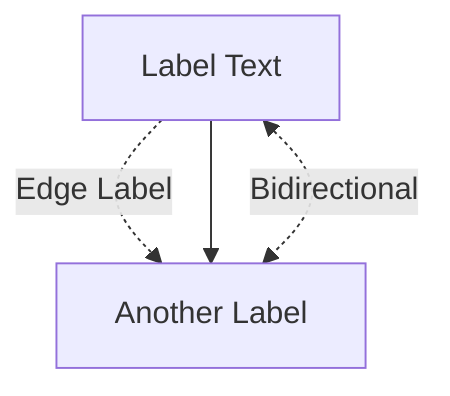

# CLAUDE.md

This file provides guidance to Claude Code (claude.ai/code) when working with code in this repository.

## Important Development Notes

**Game Architecture Decision:**
- This application uses **WebSocket-based communication** for all game interactions
- The `GameController` (REST API) is kept for reference but should **NOT be used** for game implementation
- All game functionality should be implemented through the `WebSocketController` to ensure real-time synchronization across all players

## Development Commands

### Build and Run
- `./mvnw spring-boot:run` - Start the Spring Boot application
- `./mvnw clean compile` - Clean and compile the project
- `./mvnw package` - Build JAR package
- `mvnw.cmd` - Use this on Windows instead of `./mvnw`

### Testing
- `./mvnw test` - Run all tests
- `./mvnw test -Dtest=V1ApplicationTests` - Run specific test class

## Architecture Overview

This is a **Monopoly Deal card game implementation** built with Spring Boot 3.5.4 and Java 17. The application uses a layered architecture with clear separation of concerns:

### Core Game Engine
- **GameEngine** (`src/main/java/com/monopoly_deal/v1/engine/GameEngine.java`) - Central game logic coordinator that manages game flow, turn validation, and win conditions
- **GameState** - Maintains current game state including players, deck, phase, and turn information  
- **TurnManager** - Handles turn progression and validation

### Strategy Pattern Implementation
The game uses the Strategy pattern for card actions:
- **CardActionStrategyFactory** (`src/main/java/com/monopoly_deal/v1/service/strategies/CardActionStrategyFactory.java`) - Factory that returns appropriate strategy based on card type
- **CardActionStrategy** implementations for different card types (Property, Action, Rent)
- **CardActionService** coordinates with strategies to execute card plays

### WebSocket Communication Layer
- **WebSocketController** (`src/main/java/com/monopoly_deal/v1/controller/WebSocketController.java`) - Handles all real-time game communication
- **PlayCardRequest** DTO for card play requests (used in WebSocket messages)

### Data Models
- **Card** hierarchy with specialized types (PropertyCard, MoneyCard, RentCard)
- **Player** with hand management and property sets
- **Deck** and **DiscardPile** for card management
- **PropertySet** for tracking property collections

### Game Data
Card definitions are stored as JSON files in `src/main/resources/cards/`:
- `property-card.json` - Property cards
- `action-card.json` - Action cards  
- `money-card.json` - Money cards
- `wild-card.json` - Wild cards
- **CardLoader** utility loads these at runtime

### Key Game Mechanics
- Players need 3 complete property sets to win
- Game phases: DRAW_PHASE → PLAY_PHASE → turn end
- Cards can be played as money or for their specific effects
- Turn-based gameplay with validation

### Frontend Integration
- Static test interface at `src/main/resources/static/websocket-test.html`
- WebSocket-based communication for real-time game updates
- All players receive synchronized game state updates

## Mermaid Diagram Guidelines

When creating Mermaid diagrams, use this correct syntax format:

**Correct Format:**

**Important Rules:**
- Use double quotes for node labels: `NodeA["Label Text"]`
- Add spaces around arrow operators: `-.-> |Label|` not `-.->|Label|`
- Avoid HTML line breaks (` `) in labels - use hyphens instead
- Remove comments (`%%`) if causing parsing issues