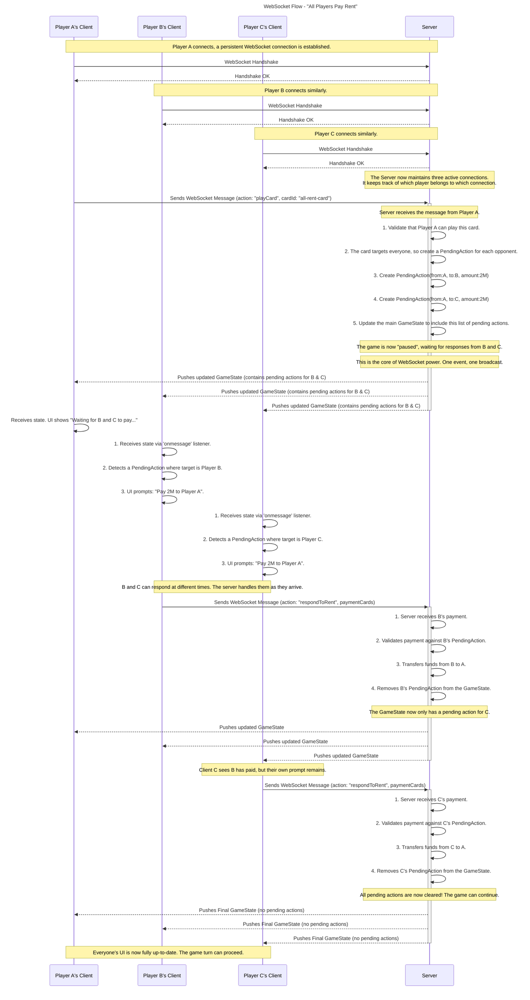

# WebSocket All Players Rent Flow

```mermaid
sequenceDiagram
    participant ClientA as Player A's Client
    participant ClientB as Player B's Client
    participant ClientC as Player C's Client
    participant Server

    Title: WebSocket Flow - "All Players Pay Rent"

    %% Step 1: Establishing Connections %%
    Note over ClientA, Server: Player A connects, a persistent WebSocket connection is established.
    ClientA->>Server: WebSocket Handshake
    Server-->>ClientA: Handshake OK

    Note over ClientB, Server: Player B connects similarly.
    ClientB->>Server: WebSocket Handshake
    Server-->>ClientB: Handshake OK

    Note over ClientC, Server: Player C connects similarly.
    ClientC->>Server: WebSocket Handshake
    Server-->>ClientC: Handshake OK

    Note over Server: The Server now maintains three active connections.<br/>It keeps track of which player belongs to which connection.

    %% Step 2: Player A Plays a Rent Card %%
    ClientA->>+Server: Sends WebSocket Message (action: "playCard", cardId: "all-rent-card")
    Note over Server: Server receives the message from Player A.

    %% Step 3: Server Processes the Action and Updates State %%
    Server->>Server: 1. Validate that Player A can play this card.
    Server->>Server: 2. The card targets everyone, so create a PendingAction for each opponent.
    Server->>Server: 3. Create PendingAction(from:A, to:B, amount:2M)
    Server->>Server: 4. Create PendingAction(from:A, to:C, amount:2M)
    Server->>Server: 5. Update the main GameState to include this list of pending actions.
    Note over Server: The game is now "paused", waiting for responses from B and C.

    %% Step 4: Server PUSHES the New State to ALL Clients %%
    Note over Server: This is the core of WebSocket power. One event, one broadcast.
    Server-->>ClientA: Pushes updated GameState (contains pending actions for B & C)
    Server-->>ClientB: Pushes updated GameState (contains pending actions for B & C)
    Server-->>ClientC: Pushes updated GameState (contains pending actions for B & C)
    deactivate Server

    %% Step 5: All Clients Receive the Update and React %%
    ClientA->>ClientA: Receives state. UI shows "Waiting for B and C to pay..."

    ClientB->>ClientB: 1. Receives state via 'onmessage' listener.
    ClientB->>ClientB: 2. Detects a PendingAction where target is Player B.
    ClientB->>ClientB: 3. UI prompts: "Pay 2M to Player A".

    ClientC->>ClientC: 1. Receives state via 'onmessage' listener.
    ClientC->>ClientC: 2. Detects a PendingAction where target is Player C.
    ClientC->>ClientC: 3. UI prompts: "Pay 2M to Player A".

    %% Step 6: Players B and C Respond Independently %%
    Note over ClientB, ClientC: B and C can respond at different times. The server handles them as they arrive.

    ClientB->>+Server: Sends WebSocket Message (action: "respondToRent", paymentCards)
    Server->>Server: 1. Server receives B's payment.
    Server->>Server: 2. Validates payment against B's PendingAction.
    Server->>Server: 3. Transfers funds from B to A.
    Server->>Server: 4. Removes B's PendingAction from the GameState.
    Note over Server: The GameState now only has a pending action for C.
    Server-->>ClientA: Pushes updated GameState
    Server-->>ClientB: Pushes updated GameState
    Server-->>ClientC: Pushes updated GameState
    deactivate Server
    Note over ClientC: Client C sees B has paid, but their own prompt remains.

    ClientC->>+Server: Sends WebSocket Message (action: "respondToRent", paymentCards)
    Server->>Server: 1. Server receives C's payment.
    Server->>Server: 2. Validates payment against C's PendingAction.
    Server->>Server: 3. Transfers funds from C to A.
    Server->>Server: 4. Removes C's PendingAction from the GameState.
    Note over Server: All pending actions are now cleared! The game can continue.

    %% Step 7: Server Pushes the Final State %%
    Server-->>ClientA: Pushes Final GameState (no pending actions)
    Server-->>ClientB: Pushes Final GameState (no pending actions)
    Server-->>ClientC: Pushes Final GameState (no pending actions)
    deactivate Server

    Note over ClientA, ClientC: Everyone's UI is now fully up-to-date. The game turn can proceed.
```