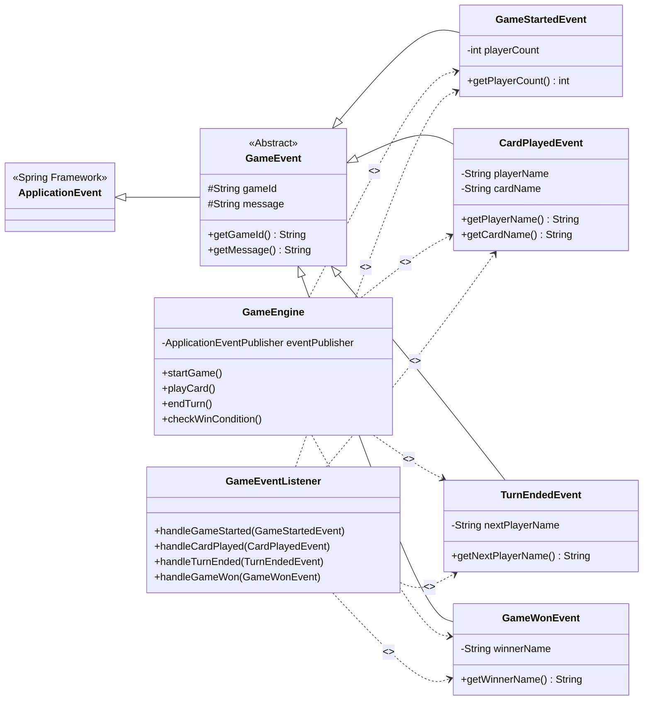

# Event Class Diagram

```mermaid
classDiagram
    direction LR

    class ApplicationEvent {
        <<Spring Framework>>
    }

    class GameEvent {
        <<Abstract>>
        #String gameId
        #String message
        +getGameId() String
        +getMessage() String
    }

    class GameStartedEvent {
        -int playerCount
        +getPlayerCount() int
    }
    class CardPlayedEvent {
        -String playerName
        -String cardName
        +getPlayerName() String
        +getCardName() String
    }
    class TurnEndedEvent {
        -String nextPlayerName
        +getNextPlayerName() String
    }
    class GameWonEvent {
        -String winnerName
        +getWinnerName() String
    }

    class GameEngine {
        -ApplicationEventPublisher eventPublisher
        +startGame()
        +playCard()
        +endTurn()
        +checkWinCondition()
    }

    class GameEventListener {
        +handleGameStarted(GameStartedEvent)
        +handleCardPlayed(CardPlayedEvent)
        +handleTurnEnded(TurnEndedEvent)
        +handleGameWon(GameWonEvent)
    }

    ApplicationEvent <|-- GameEvent

    GameEvent <|-- GameStartedEvent
    GameEvent <|-- CardPlayedEvent
    GameEvent <|-- TurnEndedEvent
    GameEvent <|-- GameWonEvent

    GameEngine ..> GameStartedEvent : <<creates>>
    GameEngine ..> CardPlayedEvent : <<creates>>
    GameEngine ..> TurnEndedEvent : <<creates>>
    GameEngine ..> GameWonEvent : <<creates>>

    GameEventListener ..> GameStartedEvent : <<handles>>
    GameEventListener ..> CardPlayedEvent : <<handles>>
    GameEventListener ..> TurnEndedEvent : <<handles>>
    GameEventListener ..> GameWonEvent : <<handles>>
```