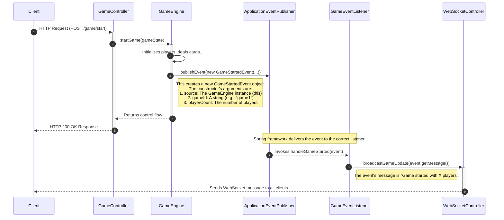

# Event-Driven Architecture Sequence

```mermaid
sequenceDiagram
    autonumber

    participant Client
    participant GameController
    participant GameEngine
    participant ApplicationEventPublisher
    participant GameEventListener
    participant WebSocketController

    Client->>+GameController: HTTP Request (POST /game/start)
    GameController->>+GameEngine: startGame(gameState)
    GameEngine->>GameEngine: Initializes players, deals cards...
    GameEngine->>ApplicationEventPublisher: publishEvent(new GameStartedEvent(...))
    Note right of GameEngine: This creates a new GameStartedEvent object.<br/>The constructor's arguments are:<br/>1. source: The GameEngine instance (this)<br/>2. gameId: A string (e.g., "game1")<br/>3. playerCount: The number of players
    GameEngine-->>-GameController: Returns control flow
    GameController-->>-Client: HTTP 200 OK Response

    Note over ApplicationEventPublisher, GameEventListener: Spring framework delivers the event to the correct listener.

    ApplicationEventPublisher-->>+GameEventListener: Invokes handleGameStarted(event)
    GameEventListener->>+WebSocketController: broadcastGameUpdate(event.getMessage())
    Note right of GameEventListener: The event's message is "Game started with X players".
    WebSocketController-->>-Client: Sends WebSocket message to all clients
```