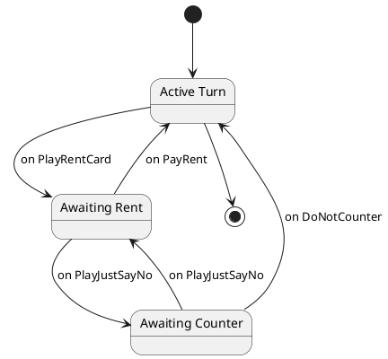
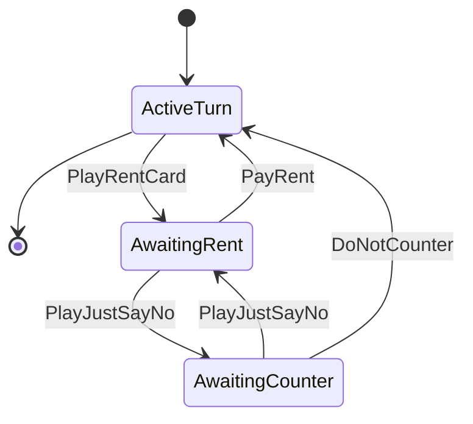

# State Machine Diagram

Note: This diagram is in PlantUML format, not Mermaid. You can view it using PlantUML tools or convert it to Mermaid syntax if needed.

```plantuml
@startuml
state "Active Turn" as ActiveTurn
state "Awaiting Rent" as AwaitingRent
state "Awaiting Counter" as AwaitingCounter

[*] --> ActiveTurn
ActiveTurn --> [*]

ActiveTurn --> AwaitingRent : on PlayRentCard
AwaitingRent --> ActiveTurn : on PayRent
AwaitingRent --> AwaitingCounter : on PlayJustSayNo

AwaitingCounter --> ActiveTurn : on DoNotCounter
AwaitingCounter --> AwaitingRent : on PlayJustSayNo

@enduml
```

## Mermaid Equivalent

```mermaid
stateDiagram-v2
    [*] --> ActiveTurn
    ActiveTurn --> [*]
    
    ActiveTurn --> AwaitingRent : PlayRentCard
    AwaitingRent --> ActiveTurn : PayRent
    AwaitingRent --> AwaitingCounter : PlayJustSayNo
    
    AwaitingCounter --> ActiveTurn : DoNotCounter
    AwaitingCounter --> AwaitingRent : PlayJustSayNo
```