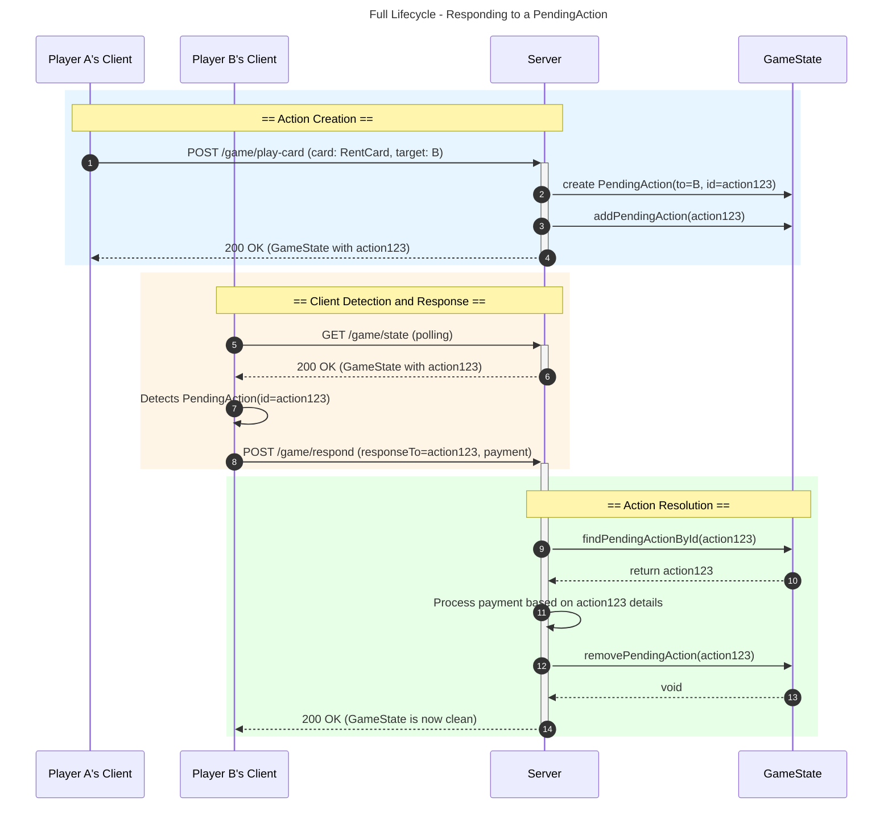

# Responding to Pending Action

```mermaid
sequenceDiagram
    autonumber
    participant ClientA as Player A's Client
    participant ClientB as Player B's Client
    participant Server
    participant GameState

    Title: Full Lifecycle - Responding to a PendingAction

    rect rgb(230, 245, 255)
    note over ClientA, Server: == Action Creation ==
    ClientA->>+Server: POST /game/play-card (card: RentCard, target: B)
    Server->>GameState: create PendingAction(to=B, id=action123)
    Server->>GameState: addPendingAction(action123)
    Server-->>-ClientA: 200 OK (GameState with action123)
    end

    rect rgb(255, 245, 230)
    note over ClientB, Server: == Client Detection and Response ==
    ClientB->>+Server: GET /game/state (polling)
    Server-->>-ClientB: 200 OK (GameState with action123)

    ClientB->>ClientB: Detects PendingAction(id=action123)

    ClientB->>+Server: POST /game/respond (responseTo=action123, payment)
    end

    rect rgb(230, 255, 230)
    note over Server, GameState: == Action Resolution ==
    Server->>GameState: findPendingActionById(action123)
    GameState-->>Server: return action123

    Server->>Server: Process payment based on action123 details

    Server->>GameState: removePendingAction(action123)
    GameState-->>Server: void

    Server-->>-ClientB: 200 OK (GameState is now clean)
    end
```