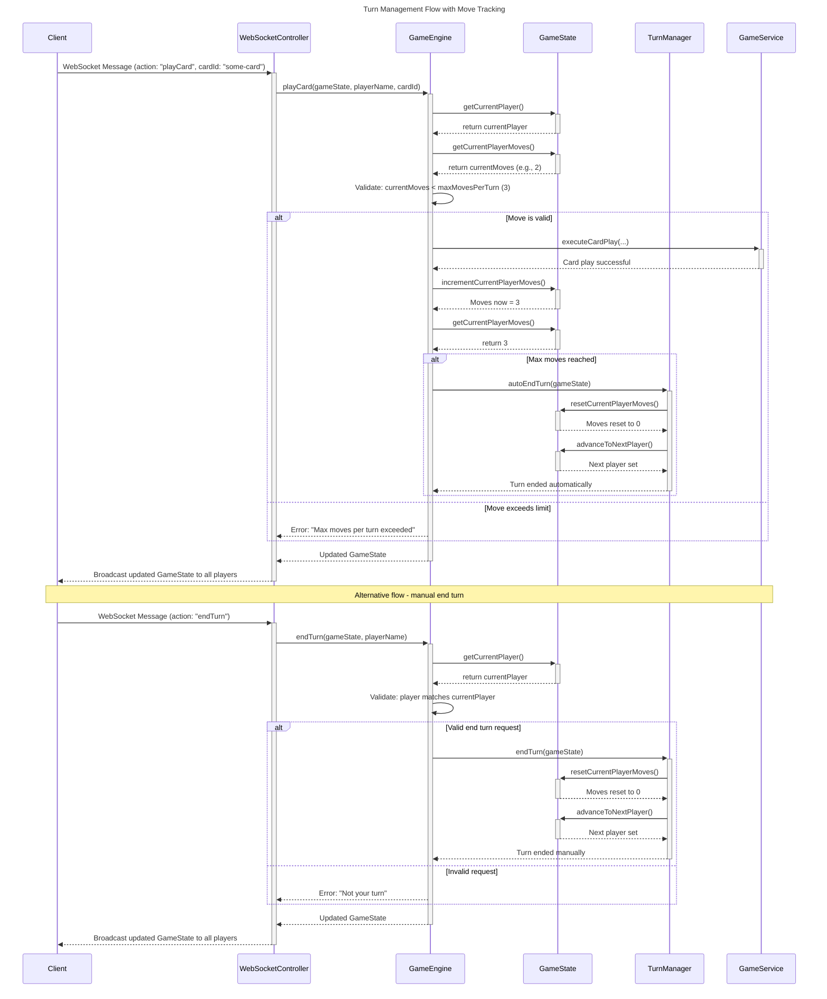

# Turn Management Flow with Move Tracking

```mermaid
sequenceDiagram
    participant Client
    participant WebSocketController
    participant GameEngine
    participant GameState
    participant TurnManager
    participant GameService

    Title: Turn Management Flow with Move Tracking

    %% Step 1: Player plays a card (any action that consumes a move) %%
    Client->>+WebSocketController: WebSocket Message (action: "playCard", cardId: "some-card")

    WebSocketController->>+GameEngine: playCard(gameState, playerName, cardId)

    GameEngine->>+GameState: getCurrentPlayer()
    GameState-->>-GameEngine: return currentPlayer

    GameEngine->>+GameState: getCurrentPlayerMoves()
    GameState-->>-GameEngine: return currentMoves (e.g., 2)

    GameEngine->>GameEngine: Validate: currentMoves < maxMovesPerTurn (3)

    alt Move is valid
        GameEngine->>+GameService: executeCardPlay(...)
        GameService-->>-GameEngine: Card play successful

        GameEngine->>+GameState: incrementCurrentPlayerMoves()
        GameState-->>-GameEngine: Moves now = 3

        GameEngine->>+GameState: getCurrentPlayerMoves()
        GameState-->>-GameEngine: return 3

        alt Max moves reached
            GameEngine->>+TurnManager: autoEndTurn(gameState)
            TurnManager->>+GameState: resetCurrentPlayerMoves()
            GameState-->>-TurnManager: Moves reset to 0
            TurnManager->>+GameState: advanceToNextPlayer()
            GameState-->>-TurnManager: Next player set
            TurnManager-->>-GameEngine: Turn ended automatically
        end

    else Move exceeds limit
        GameEngine-->>WebSocketController: Error: "Max moves per turn exceeded"
    end

    GameEngine-->>-WebSocketController: Updated GameState
    WebSocketController-->>-Client: Broadcast updated GameState to all players

    %% Step 2: Player manually ends turn (before max moves) %%
    Note over Client, GameService: Alternative flow - manual end turn

    Client->>+WebSocketController: WebSocket Message (action: "endTurn")

    WebSocketController->>+GameEngine: endTurn(gameState, playerName)

    GameEngine->>+GameState: getCurrentPlayer()
    GameState-->>-GameEngine: return currentPlayer

    GameEngine->>GameEngine: Validate: player matches currentPlayer

    alt Valid end turn request
        GameEngine->>+TurnManager: endTurn(gameState)
        TurnManager->>+GameState: resetCurrentPlayerMoves()
        GameState-->>-TurnManager: Moves reset to 0
        TurnManager->>+GameState: advanceToNextPlayer()
        GameState-->>-TurnManager: Next player set
        TurnManager-->>-GameEngine: Turn ended manually
    else Invalid request
        GameEngine-->>WebSocketController: Error: "Not your turn"
    end

    GameEngine-->>-WebSocketController: Updated GameState
    WebSocketController-->>-Client: Broadcast updated GameState to all players
```