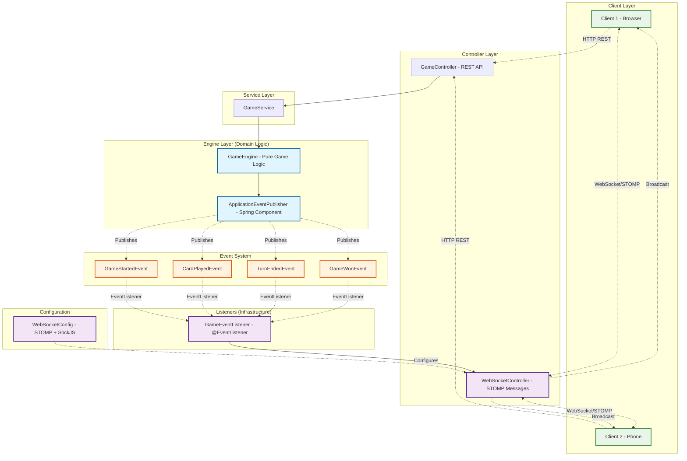

# WebSocket Architecture

```mermaid
graph TB
    subgraph "Client Layer"
        Client1["Client 1 - Browser"]
        Client2["Client 2 - Phone"]
    end

    subgraph "Controller Layer"
        GC["GameController - REST API"]
        WSC["WebSocketController - STOMP Messages"]
    end

    subgraph "Service Layer"
        GS["GameService"]
    end

    subgraph "Engine Layer (Domain Logic)"
        GE["GameEngine - Pure Game Logic"]
        EP["ApplicationEventPublisher - Spring Component"]
    end

    subgraph "Event System"
        GSE["GameStartedEvent"]
        CPE["CardPlayedEvent"]  
        TEE["TurnEndedEvent"]
        GWE["GameWonEvent"]
    end

    subgraph "Listeners (Infrastructure)"
        GEL["GameEventListener - @EventListener"]
    end

    subgraph "Configuration"
        WSConfig["WebSocketConfig - STOMP + SockJS"]
    end

    Client1 -.-> |HTTP REST| GC
    Client2 -.-> |HTTP REST| GC
    Client1 <-.-> |WebSocket/STOMP| WSC
    Client2 <-.-> |WebSocket/STOMP| WSC
    WSConfig -.-> |Configures| WSC

    GC --> GS
    GS --> GE

    GE --> EP
    EP -.-> |Publishes| GSE
    EP -.-> |Publishes| CPE
    EP -.-> |Publishes| TEE  
    EP -.-> |Publishes| GWE

    GSE -.-> |EventListener| GEL
    CPE -.-> |EventListener| GEL
    TEE -.-> |EventListener| GEL
    GWE -.-> |EventListener| GEL

    GEL --> WSC
    WSC -.-> |Broadcast| Client1
    WSC -.-> |Broadcast| Client2

    %% Styling
    classDef domainLogic fill:#e1f5fe,stroke:#01579b,stroke-width:2px
    classDef infrastructure fill:#f3e5f5,stroke:#4a148c,stroke-width:2px
    classDef events fill:#fff3e0,stroke:#e65100,stroke-width:2px
    classDef clients fill:#e8f5e8,stroke:#2e7d32,stroke-width:2px

    class GE,EP domainLogic
    class WSC,GEL,WSConfig infrastructure
    class GSE,CPE,TEE,GWE events
    class Client1,Client2 clients
```